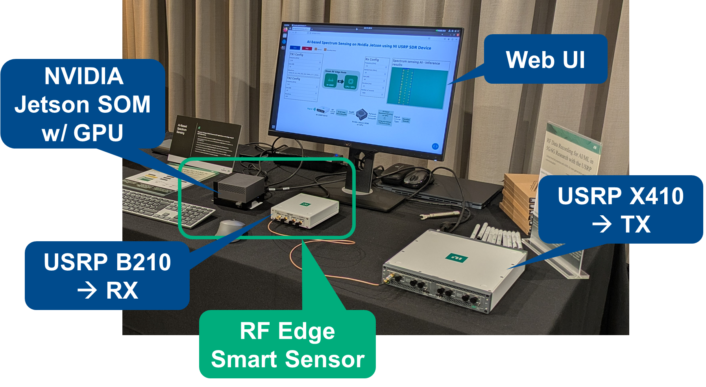
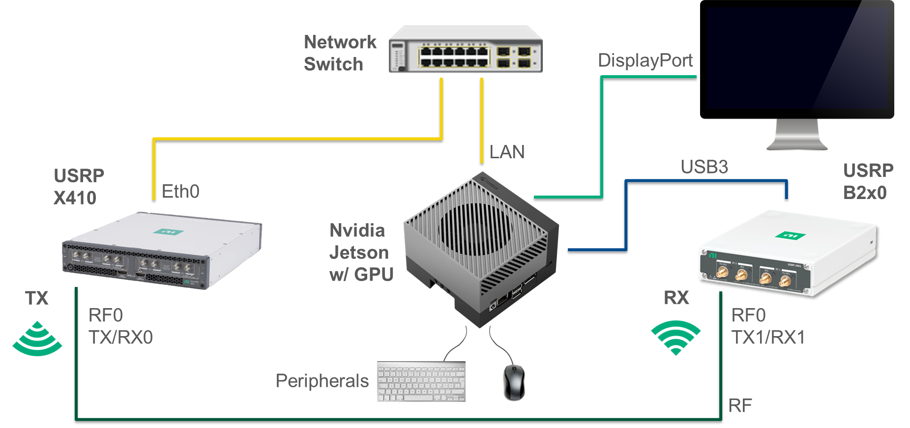
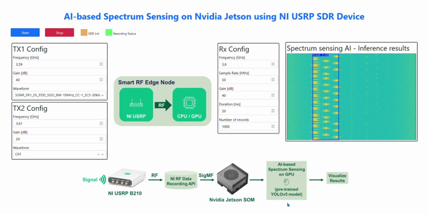

# RF Edge Smart Sensor - A Spectrum Sensing Application with NI USRP and Nvidia Jetson

This document provides information on how to setup the RF Edge Smart Sensor application.

## Contents

<details>
<summary>"Click to expand"</summary>

- [Overview](#overview)
- [System Requirements](#system-requirements)
  - [Hardware](#hardware)
  - [Software](#software)
  - [Network](#network)
- [Installation](#installation)
  - [Preparations](#preparations)
  - [UHD Installation](#uhd-installation)
    - [Post Installation Tasks](#post-installation-tasks)
    - [UHD Installation Verification](#uhd-installation-verification)
  - [PyTorch Installation](#pytorch-installation)
    - [Preparation](#preparation)
    - [PyTorch](#pytorch)
    - [PyTorch Vision](#pytorch-vision)
  - [Python Virtual Environment](#python-virtual-environment)
    - [Setup](#setup)
  - [Python Requirements](#python-requirements)
  - [YOLOv5 Model](#yolov5-model)
  - [Demo Code and Data Recording API](#demo-code-and-data-recording-api)
- [Configuration](#configuration)
  - [Configuration Files](#configuration-files)
  - [Code Adaptations](#code-adaptations)
    - [Inference Code](#inference-code)
    - [UI Code](#ui-code)
- [Demo Execution](#demo-execution)
- [Appendix](#appendix)
  - [Advanced Topics](#advanced-topics)
    - [Remote Execution](#remote-execution)
    - [Enabling the DHCP Server](#enabling-the-dhcp-server)
    - [USRP X410 Update](#usrp-x410-update)
  - [Troubleshooting](#troubleshooting)
    - [Known Issues and Limitations](#known-issues-and-limitations)

</details>

## Overview


*Figure 1: RF Edge Smart Sensor - Setup*

In this demonstration depicted in Figure 1, we will show how to combine a USB-powered USRP together with a Nvidia Jetson System-On-Module (SOM) to create a prototype RF Edge Smart Sensor running an AI-based spectrum sensing example application. The application will use the GPU capabilities of the Jetson device to accelerate the AI-based signal detection. The USRP receiver will capture RF samples using the open-source UHD drivers. Data Records containing the captured RF samples are stored as SigMF records using the NI RF Data Recording API which also allows for additional meta data required for example in training or fine-tuning the AI-based detection model. The RF signals are either sourced from one or two USRP X410 or can be provided via live signals if the conditions are well known and stable. The web UI can be run in a browser locally on the Jetson device or forwarded to a different network connected client.

⚠️ **Caution:** Before using your hardware, read all product documentation to ensure compliance with safety, EMC, and environmental regulations.

⚠️ **Caution:** To ensure the specified EMC performance, operate the RF devices only with shielded cables and accessories.

⚠️ **Caution:** To ensure the specified EMC performance, the length of all I/O cables except for those connected to the GPS antenna input of the USRP device must be no longer than 3 m (10 ft.).

⚠️ **Caution:** The USRP RIO RF devices are not approved or licensed for transmission over the air using an antenna. As a result, operating this product with an antenna may violate local laws. Ensure that you are in compliance with all local laws before operating this product with an antenna.

## System Requirements

### Hardware


*Figure 2: Hardware Configuration*

In this demo setup, we will use a Nvidia Jetson AGX Orin DevKit as the main execution platform. We will also use a USB-powered NI USRP B2xx (or NI USRP 290x) as the RF receiver. Additionally, we use one or two NI USRP X410 as RF transmitters. It is also possible to capture live RF signals from the environment, but this use case has not been tested thoroughly and requires adaptations to the specific environment (RX gain, center frequency, possible RF signals to detect, etc.) No additional host computer is required. However, it is possible to forward and show the demo UI on a different host. It is recommended to use an external display as well as a dedicated keyboard and mouse. Figure 2 shows the setup using a single receiver and a single transmitter. Table 1 presents the required hardware for this configuration.

| Item | Count | Notes |
|------|-------|-------|
| Nvidia Jetson AGX Orin DevKit | 1 | Incl. power supply |
| NI USRP B2xx | 1 | Incl. USB3 cable |
| NI USRP X410 | 1 | Incl. power supply |
| RF Cable | 1 | SMA female/female, 6 GHz |
| RF Attenuator 30 dB | 1 | SMA male/female, 6 GHz|
| Network Switch / Router | 1 | Incl. power supply |
| Ethernet cable | 2 | |
*Table 1: Required Hardware Accessories*

### Software

For this demo setup, the assumption is that the Nvidia Jetson device runs JetsonPack 5.1x with Ubuntu 20.04 as the OS. The main software components are UHD and the NI RF Data Recording API. The demo UI is built with Python and makes use of a YOLO AI-based image detection model. We will use the default Python version of 3.8 that ships with the OS. However, you can build UHD on different operating systems and Python versions. Refer to [Building and Installing the USRP Open-Source Toolchain (UHD and GNU Radio) on Linux - Ettus Knowledge Base](https://kb.ettus.com/Building_and_Installing_the_USRP_Open-Source_Toolchain_(UHD_and_GNU_Radio)_on_Linux) for more information.

### Network

There are two possible scenarios for how to connect the setup to a network. 1) Using an external DHCP server and 2) Self-serving a DHCP server to supply the connected devices with IP connectivity. For 1) it is recommended to use a network switch and simply connect all networked devices to the switch. Scenario 2) requires configuring the Nvidia Jetson device as DHCP server and either use a network switch or directly connect the networked device in case of a single device. It would also be possible to manually configure IP addresses, but this is discouraged due to the complexity involved and the potential risk of misconfigurations.

## Installation

The following instructions are based on Ubuntu 20.04 OS with the default Python 3.8 environment.

### Preparations

We will create a common folder in the user directory to store the demo application and its dependencies.

 - Connect and login to the Nvidia Jetson device and open a terminal
 - Create a new *workspace* folder, preferably in your home directory
    ```shell
    cd ~
    mkdir workspace && cd workspace
    ```

### UHD Installation

We will need UHD 4.7 including UHD Python API support which we will build from source.

💡 Note: If UHD is already installed, it must be uninstalled before proceeding with a new installation.

- Update system packages first
    ```shell
    sudo apt-get update && sudo apt-get -y upgrade
    ```
- Install dependencies
    ```shell
    sudo apt-get install autoconf automake build-essential ccache cmake cpufrequtils doxygen ethtool g++ git inetutils-tools libboost-all-dev libncurses5 libncurses5-dev libusb-1.0-0 libusb-1.0-0-dev libusb-dev python3-dev python3-mako python3-numpy python3-requests python3-scipy python3-setuptools python3-ruamel.yaml
    ```
- Clone the UHD 4.7 release branch
    ```shell
    git clone -b UHD-4.7 https://github.com/EttusResearch/uhd.git
    ```
- Prepare building
    ```shell
    cd uhd/host
    mkdir build && cd build
    cmake -DENABLE_PYTHON_API=ON -DPYTHON_INCLUDE_DIR=/usr/include/python3.8 -DPYTHON_LIBRARY=/usr/lib/aarch64-linux-gnu/libpython3.8.so -DPYTHON_EXECUTABLE=/usr/bin/python3.8 -DRUNTIME_PYTHON_EXECUTABLE=/usr/bin/python3.8 ..
    ```
- Build UHD
    ```shell
    make -j6
    ```
- [Optional] Run tests
    ```shell
    make test
    ```
- Install the build
    ```shell
    sudo make install
    ```
- Setup library path
    ```shell
    sudo ldconfig
    ```

#### Post Installation Tasks

- Download USRP images:
    ```shell
    sudo /usr/local/bin/uhd_images_downloader
    ```
- Add USB udev rule (the rules can be limited to specific vendor/device IDs if needed)
    ```shell
    sudo nano /etc/udev/rules.d/99-usb.rules
    ```
    - `SUBSYSTEM==”usb”,MODE=”0666”`
    ```shell
    sudo udevadm control --reload-rules
    sudo udevadm trigger
    ```
- Unplug and re-plug the USB device if it was already connected
- Enable Python UHD API visibility by creating a *.pth* file to point to site-packages location
    ```shell
    echo "/usr/local/lib/python3.8/site-packages" | sudo tee /usr/local/lib/python3.8/dist-packages/local-site-packages.pth
    ```

#### UHD Installation Verification

- Find connected USRP devices
    ```shell
    uhd_find_devices
    ```
- Run throughput benchmark on the B2x0 device
    ```shell
    /usr/local/lib/uhd/examples/benchmark_rate --args "type=b200" --rx_rate 10e6
    ```
- Run Python throughput benchmark
    ```shell
    python3.8 /usr/local/lib/uhd/examples/python/benchmark_rate.py --args "type=b200" --rx_rate 10e6
    ```

### PyTorch Installation

While a Jetson-specific PyTorch package is readily available from Nvidia, PyTorch Vision (torchvision) must be built from source.

#### Preparation

- Make sure to start from our workspace folder
    ```shell
    cd ~/workspace
    ```

#### PyTorch

- Download PyTorch for Jetson
    ```shell
    wget https://developer.download.nvidia.cn/compute/redist/jp/v511/pytorch/torch-2.0.0+nv23.05-cp38-cp38-linux_aarch64.whl
    ```
- Install PyTorch from downloaded wheel file
    ```shell
    sudo pip3 install torch-2.0.0+nv23.05-cp38-cp38-linux_aarch64.whl
    ```

#### PyTorch Vision

- Install dependencies
    ```shell
    sudo apt-get install libjpeg-dev zlib1g-dev libpython3-dev libopenblas-dev libavcodec-dev libavformat-dev libswscale-dev
    ```
- Clone the source repo
    ```shell
    git clone --branch v0.15.1 https://github.com/pytorch/vision torchvision
    ```
- Build and install
    ```shell
    cd torchvision
    export BUILD_VERSION=0.15.1
    python3.8 setup.py install --user
    ```

### Python Virtual Environment

To isolate the working environment from the system, we will use a virtual Python environment.

#### Setup

- Make sure to start from our workspace folder
    ```shell
    cd ~/workspace
    ```
- Install venv support if necessary
    ```shell
    sudo apt-get install python3.8-venv
    ```
- Create the virtual environment with enabled support for system packages like UHD
    ```shell
    python3.8 -m venv .venv --system-site-packages --prompt demo
    ```
- Enable the virtual environment
    ```shell
    source .venv/bin/activate
    ```
- Update pip
    ```shell
    python -m pip install pip -U
    ```

### Python Requirements

- SigMF
    ```shell
    pip install sigmf
    ```
- npTDMS
    ```shell
    pip install npTDMS
    ```
- Colored Terminal
    ```shell
    pip install colored termcolor
    ```
- Dash
    ```shell
    pip install dash dash_daq dash_bootstrap_components
    ```
- YOLOv5
    ```shell
    pip install -U gitpython>=3.1.30 matplotlib>=3.3 numpy>=1.23.5 opencv-python>=4.1.1 pillow>=10.3.0 psutil PyYAML>=5.3.1 requests>=2.32.2 scipy>=1.4.1 thop>=0.1.1 tqdm>=4.66.3 ultralytics>=8.2.34 setuptools>=70.0.0
    ```

### YOLOv5 Model

The demo application is currently using the [YOLOv5](https://github.com/ultralytics/yolov5) image detection model from [Ultralytics](https://www.ultralytics.com/) which comes with an AGPL-3.0 license.

- Make sure to start from our workspace folder
    ```shell
    cd ~/workspace
    ```
- Clone the YOLOv5 repo
    ```shell
    git clone https://github.com/ultralytics/yolov5
    ```

💡 Note: For a more permissive license, https://github.com/WongKinYiu/YOLO might be an alternative that uses a MIT license. This might, however, require additional code changes and has not been tested.

### Demo Code and Data Recording API

The demo application is part of the examples from the NI RF Data Recording API which we need to clone locally.

- Make sure to start from our workspace folder
    ```shell
    cd ~/workspace
    ```
- Clone the NI RF Data Recording GitHub repository
    ```shell
    git clone https://github.com/ni/ni-rf-data-recording-api.git
    ```

## Configuration

We need to modify the configuration files and possibly make changes to some of the code modules.

### Configuration Files

The configuration files can be found in ***ni-data-recording-api/examples/spectrum_sensing/config/***. There are four different configuration files used depending on the TX settings in the demo UI. Table 2 lists how the possible settings map to the corresponding configuration files.

| Number of TX Devices | TX Configuration | Configuration File Suffix |
|----------------------|------------------|---------------------------|
| 0 | - | config_spectrum_sensing_1Rx.json |
| 1 | TX1 | config_spectrum_sensing_1Tx1_1Rx.json |
| 1 | TX2 | config_spectrum_sensing_1Tx2_1Rx.json |
| 2 | TX1 and TX2 | config_spectrum_sensing_2Tx_1Rx.json |
*Table 2: Configuration Files*

The following changes can be made in each of the listed configuration files:

**general_config**
- **author**
  - This setting can be set to a descriptive name to identify the producer of the recorded data
- **description**
  - This setting can be used to provide more details about the specific set of recorded data
- **dwell_time**
  - This setting is used to specify the waiting time between consecutive records to align with inference performance

**receivers_config**
- **type**
  - This setting sets the type of device that is used. If there is only a single device per device type, this setting is sufficient to specify a device. We will use `b200` in our demo setup.
- **name**
  - Sets the name of the device that is used. This setting can be used stand-alone or together with **type** to further narrow down the device to be used. We don’t need to specify the **name** in our demo setup as we only have a single B2xx device.
- **recv_frame_size**
  - This setting can be used to improve the USB protocol throughput. If used, it is recommended to use the maximum setting of **16360**.
- **num_recv_frames**
  - This setting can be used to improve the USB protocol throughput. If used, it is recommended to use a setting of **32**.

**transmitters_config**
- **type**
  - This setting sets the type of device that is used. If there is only a single device per device type, this setting is sufficient to specify a device. We will use `x4xx` in our demo setup.
- **name**
  - Sets the name of the device that is used. This setting can be used stand-alone or together with **type** to further narrow down the device to be used. In our demo setup the USRP X410 should either be specified by its name or its IP address.
- **addr** (or **IPaddress**)
  - Sets the network IP address of the device that is used. This setting can be used stand-alone or together with **type** to further narrow down the device to be used. In our demo setup the USRP X410 should either be specified by its name or its IP address.

💡 Note: Additional settings like LO offset frequency or antenna port can be applied to the receiver or transmitters.

### Code Adaptations

Further settings can be applied by directly changing the code modules.

#### Inference Code

The file that handles the model inference is located at ***ni-rf-data-recording-api/examples/spectrum_sensing/inference.py***. The following changes can be applied if needed:
- **weights_path**: specifies the trained model used for image detection
- **YOLOv5_dir**: points to the cloned `YOLOv5`repository
- **datasets_path**: points to the parent folder for the configured location of data records and results
- **rx_records_path**: specifies the location of data records
- **spectogram_folder**: specifies the location of immediate results
- **inference_results_folder**: specifies the location of inference results

#### UI Code

The UI code is in the file located at ***ni-rf-data-recording-api/examples/spectrum_sensing/spectrum_sensing.py***. The following changes can be applied if needed:
- **short_title**: specifies the title for the UI website
- **long_title**: specifies the title shown at the UI
  - Change to `AI-based Spectrum Sensing on Nvidia Jetson using NI USRP` for this demonstration
- **block_diagram_img**: defines the image shown as system block diagram
  - Change to `RF_Smart_Edge_Node_Block_Diagram.png` for this demonstration
- **system_diagram_img**: defines the image shown as data block diagram
  - Change to `RF_Smart_Edge_System_Block_Diagram_B210.png` or `RF_Smart_Edge_Node_System_Diagram_B206.png` depending on the used hardware
- **gui_status_update_rate_ms**: use this setting to change the rate of status updates
- **gui_fig_update_rate**: use this setting to change the rate with which new results are shown to align with system performance
- **datasets_path**: points to the parent folder for the configured location of data records and results
- **rx_records_path**: specifies the location of data records
- **inference_results_folder**: specifies the location of inference results
- **ni_rf_data_recording_api_path**: specifies the location of the NI RF Data Recording API

## Demo Execution

The demo consists of two separate Python processes that need to be run in parallel using two terminals. The UI itself runs in a normal browser window at the URL http://127.0.0.1:8050. Note that the following instructions assume that the virtual Python environment is enabled, and the starting folder is the *~/workspace* directory.

**Terminal 1**
- Change to the location of the inference code
    ```shell
    cd ni-rf-data-recording-api/examples/spectrum_sensing
    ```
- Start the inference script
    ```shell
    python inference.py
    ```

**Terminal 2**
- Change to the location of the UI code
    ```shell
    cd ni-rf-data-recording-api/examples/spectrum_sensing
    ```
- Start the UI script
    ```shell
    python spectrum_sensing.py
    ```
- Open the UI in the default browser by clicking the link provided in the terminal output or enter the URL manually in a browser of your choice

**Web UI**
- Verify the desired **RX** and **TX configuration**
  - It is advisable to not transmit signals on the RX center frequency to avoid potential LO leakage
  - RX and TX gain values should be used to tune for best signal SNR
  - Set the desired waveform for TX1 and disable the waveform for TX2 by setting it to OFF
- Click on the **Start** button to start the demonstration
  - Samples will be captured regularly and provided to the model for signal detection
  - The model will detect the signal category and return an annotated result
- The results will be shown in the "**Spectrum sensing AI – Inference results**" window. The displayed images contain the frequency spectrum vs. time data which is annotated with the detected signal category and marked with a confidence value, e.g. 0.97
- Click on the **Stop** button before changing to a different configuration

A screenshot of the running web UI can be found in Figure 3.


*Figure 3: Web UI*

## Appendix

### Advanced Topics

#### Remote Execution

The demo code can be controlled and presented using a remote system. There are different options available:

**Remote Control**

Basic remote control is realized by connecting to the Jetson device via SSH. This should work from other Linux or Windows systems. The general command assuming a configured <user> on the Jetson with the DNS name <jetson> is:
```shell
ssh <user>@<jetson>
```

**Remote Control with port forwarding**

Port forwarding is achieved by specifying the ports to be forwarded. Port 8050 is the default port used for this demo.
```shell
ssh -L 8050:localhost:8050 <user>@<jetson>
```

💡 Note: Running from a developer environment like VS Code might automatically offer port forwarding upon detection of a remote port use.

**Serving to remote clients**

The demo can be served to connected clients by modifying the UI code located at ***ni-rf-data-recording-api/examples/spectrum_sensing/spectrum_sensing.py***. Scroll down to the end of the Python file and add the `host` argument to the function call as shown below:
```python
# *** Main Function ***
if __name__ == "__main__":
    app.run(debug=True, dev_tools_ui=False, host="0.0.0.0")
```
💡 Note: Clients need to connect to the demo system using either its IP address or DNS name, e.g. http://agx-orin:8050/

#### Enabling the DHCP Server

The Jetson device can act as a DHCP server providing IP addresses to connected devices like the USRP X410 or a notebook to display the demo UI. This should be done while disconnected from an existing network. It is also advisable to make configuration changes while working directly on the Jetson device.

- Install the DHCP server
    ```shell
    sudo apt-get install isc-dhcp-server
    ```
- Edit the default configuration file
    ```shell
    sudo nano /etc/dhcp/dhcpd.conf
    ```
- Add or modify the following lines
    ```
    default-lease-time 600;
    max-lease-time 7200;
    subnet 192.168.1.0 netmask 255.255.255.0 {
        range 192.168.1.10 192.168.1.100;
        option routers 192.168.1.1;
        option domain-name-servers 8.8.8.8, 8.8.4.4;
    }
    ```
- Edit the server configuration file
    ```shell
    sudo nano /etc/default/isc-dhcp-server
    ```
- Set the network interface
    ```
    INTERFACESv4="eth0"
    ```
- Start and enable the DHCP server
    ```shell
    sudo systemctl start isc-dhcp-server
    sudo systemctl enable isc-dhcp-server
    ```
- Stop and disable the DHCP server
    ```shell
    sudo systemctl disable isc-dhcp-server
    sudo systemctl stop isc-dhcp-server
    ```
- Remove the DHCP server if no longer needed
    ```shell
    sudo apt-get remove isc-dhcp-server
    ```

💡 Note: The Jetson device must be configured with a static IP address of `192.168.1.1` which is best achieved through the Ubuntu UI-based configuration tool.

#### USRP X410 Update

Depending on the software state of the X410 device, it might be necessary to update the internal software to retain compatibility with the UHD host drivers. The update procedure for the USRP X410 is as follows (commands are to be executed from a different host):

- Connect the X410 device to the network
- Find the device IP address or DNS name
    ```shell
    uhd_find_devices --args "type=x4xx"
    ```
- Connect to the X410 device using SSH
    ```shell
    ssh root@<ip-address-or-dns-name>
    ```
- Update to specific version using a tag, e.g. “UHD-4.7”
    ```shell
    usrp_update_fs -t UHD-4.7
    ```
- Reboot the device
    ```shell
    reboot
    ```
- Re-connect and commit the changes if everything operates normally
    ```shell
    ssh root@<ip-address-or-dns-name>
    mender commit
    ```

### Troubleshooting

#### Known Issues and Limitations
- Tested with USRP B206, USRP B210, USRP 2901 receivers only
- Tested with USRP X410 single transmitter only
- Performance is currently limited by the file-based approach between RF captures, inference and display of results. With that, the GPU is not heavily loaded right now.
- DHCP does not work correctly after cold start of the Jetson SOM
  - Add a delay to the DHCP server start-up:
    ```shell
    sudo nano /lib/systemd/system/isc-dhcp-server.service
    ```
  - Add the following to the `[Service]` section:
    ```
    ExecStartPre=/bin/sleep 10
    ```
  - Restart the system
